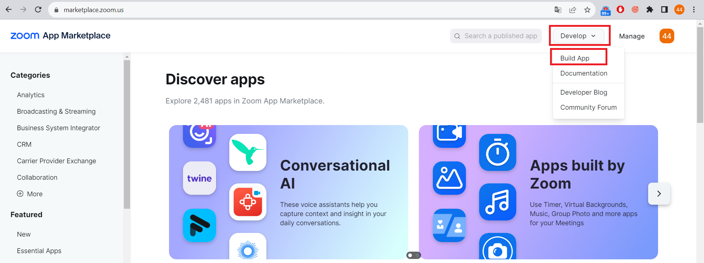
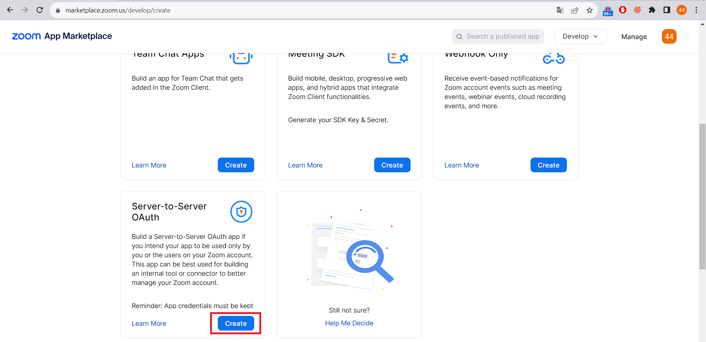
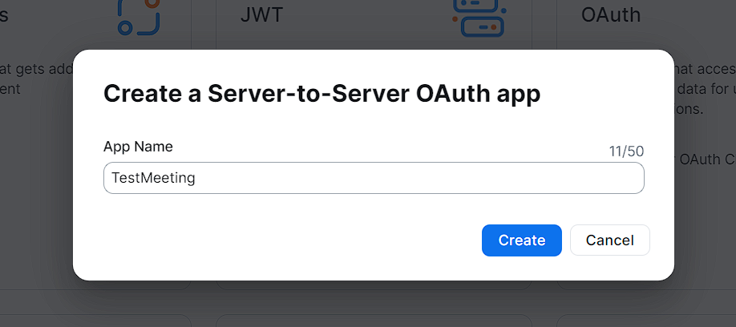
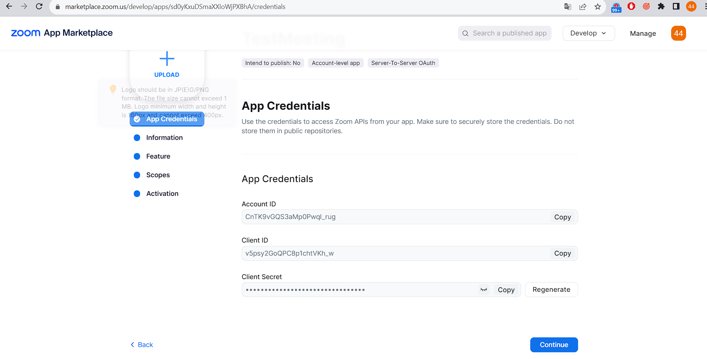
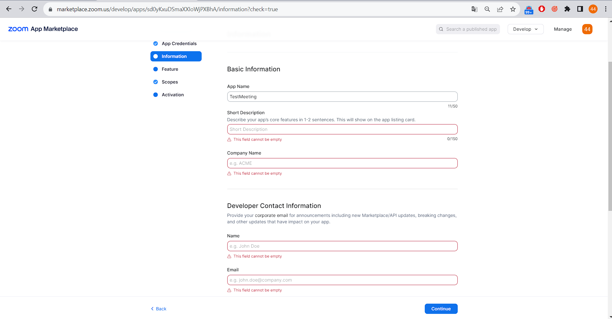
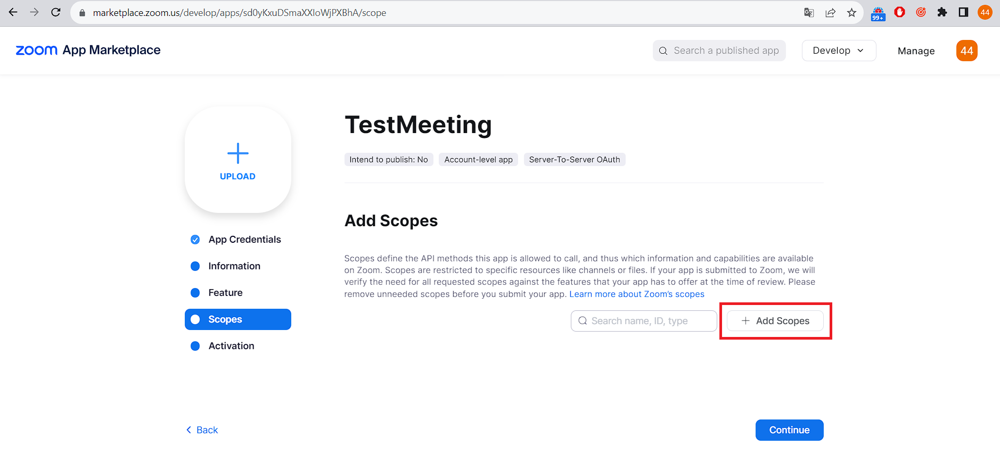
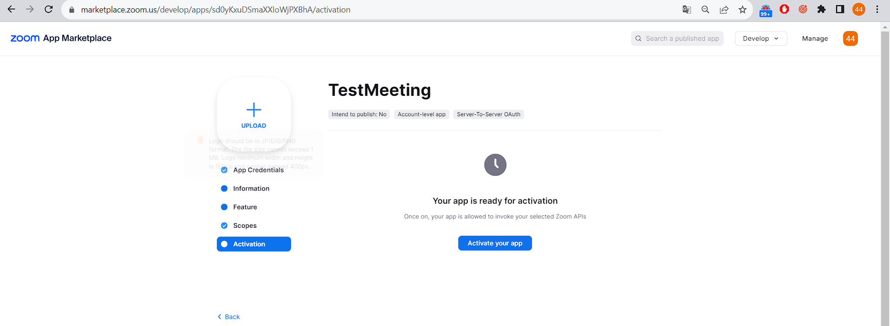
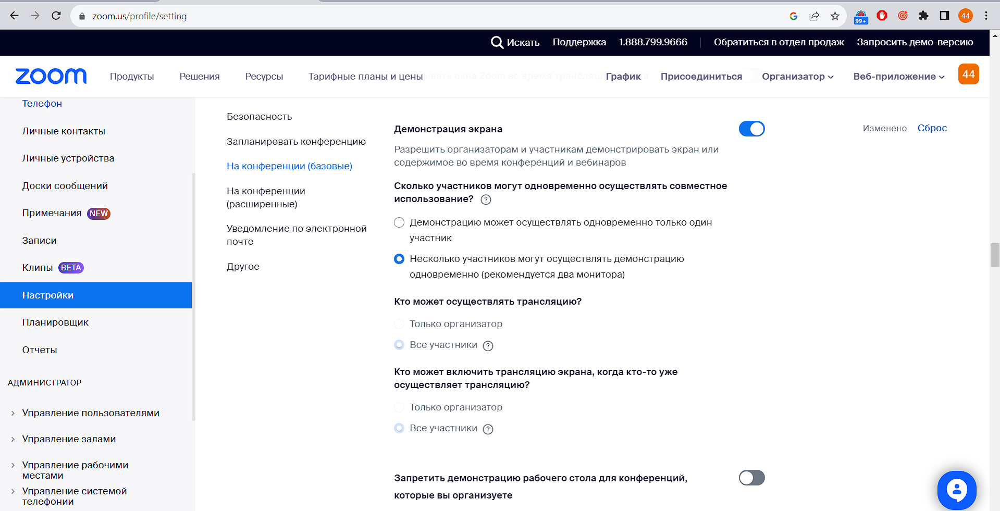

# Задание:  
Дано: Java 8, без фреймфорков  
Нужно: реализовать автоматическое создание видео-встречи в ZOOM при помощи zoom API.
На вход приходит дата и время (возможно еще что-то если нужно). На выходе получаем ссылку.

Для запуска потребуется:
1. ID клиента (Client ID)
2. Секрет клиента (Client Secret)
3. ID аккаунта (Account ID)

Для их получения необходимо создать Server-to-Server OAuth app. Для этого:  
Переходим в AppMarketplace https://marketplace.zoom.us/develop/create  
Регестрируемся -> Developer -> Build App  

Проматываем вниз и выбираем Server-to-Server OAuth  

Вводим название -> create  

После создания сгенерируются Account ID, Client ID и Client Secret. Копируем их в наш код, в поля ACCOUNT_ID, CLIENT_ID и CLIENT_SECRET соответственно  

На вкладке Information заполняем обязательные поля:

Переходим далее, необходимо заполнить Scopes:
Для работы с Митингами необходимы следующие scopes: meeting:write:admin

Активируем приложение на вкладке Activation

Запускаем приложение.

**Обратите внимание**: чтобы разрешить всем пользователям демонстрировать экран, необходимо в настройках аккаунта выдать соответствующие разрешение 

